# TheBoard Room - GOD Document

> **Guaranteed Organizational Document** - Developer-facing reference for TheBoard Room
>
> **Last Updated**: 2026-02-02
> **Domain**: Meeting & Collaboration
> **Status**: Active

---

## Product Overview

**TheBoard Room** is a real-time 3D/2D visualization application for multi-agent brainstorming meetings. It renders a cyberpunk-styled circular boardroom where AI agents (participants) are seated around a table, with visual indicators showing who is currently speaking, turn types (response vs. turn), and meeting progress metrics.

The visualization creates an immersive experience for observing agent collaboration, showing consensus meters, novelty gauges, round counters, and detailed agent statistics. It operates in **read-only mode**, consuming events from TheBoard orchestrator via Bloodbank without emitting any events back to the pipeline.

**Key Capabilities:**
- Real-time visualization of multi-agent meetings via WebSocket/STOMP connection to Bloodbank
- Dual rendering modes: 2D (PixiJS) for cyberpunk aesthetic, 3D (PlayCanvas) for immersive view
- Dynamic participant management with circular table arrangement
- Visual speaking indicators with turn-type color coding (cyan for turns, purple for responses)
- Meeting metrics display: consensus level, novelty gauge, round counter, elapsed timer
- Agent stats panels showing reasoning, articulation, focus, creativity, and expertise
- Meeting insights dashboard (Phase 3B) displaying top comments, category distribution, and participation
- Seamless fallback to demo mode when Bloodbank is unavailable

---

## Architecture Position

```mermaid
graph TB
    subgraph "33GOD Pipeline"
        subgraph "Meeting & Collaboration Domain"
            TB[TheBoard<br/>Meeting Orchestrator]
            BR[TheBoard Room<br/>Visualization UI]
        end

        subgraph "Infrastructure Domain"
            BB[Bloodbank<br/>Event Bus]
        end
    end

    TB -->|publishes meeting events| BB
    BB -->|theboard.*.*| BR

    style BR fill:#0a0a12,stroke:#00f0ff,stroke-width:2px
    style BB fill:#1a1a2e,stroke:#a855f7
    style TB fill:#1a1a2e,stroke:#22c55e
```



**Role in Pipeline**: TheBoard Room is a **terminal consumer** in the meeting visualization flow. It receives all `theboard.*.*` events from Bloodbank and translates them into visual representations. It does not produce any events, making it a pure read-only visualization layer.

**Data Flow:**
```
TheBoard (Python CLI)
    -> Bloodbank (RabbitMQ)
    -> TheBoard Room (WebSocket/STOMP)
    -> Browser (WebGL/Canvas)
```

---

## Event Contracts

### Bloodbank Events Emitted

| Event Name | Routing Key | Payload Schema | Trigger Condition |
|------------|-------------|----------------|-------------------|
| _None_ | _N/A_ | _N/A_ | TheBoard Room is read-only |

### Bloodbank Events Consumed

| Event Name | Routing Key | Handler | Purpose |
|------------|-------------|---------|---------|
| `meeting.created` | `theboard.meeting.created` | `processEvent()` | Initialize meeting state, set topic/max rounds |
| `meeting.started` | `theboard.meeting.started` | `processEvent()` | Mark meeting active, populate participants |
| `participant.added` | `theboard.meeting.participant.added` | `processEvent()` | Add participant avatar to table |
| `participant.turn.completed` | `theboard.meeting.participant.turn.completed` | `processEvent()` | Update speaker indicator, set turn type |
| `meeting.round_completed` | `theboard.meeting.round_completed` | `processEvent()` | Update round counter, adjust novelty gauge |
| `meeting.comment_extracted` | `theboard.meeting.comment_extracted` | `processEvent()` | Log comment (visual overlay future) |
| `meeting.converged` | `theboard.meeting.converged` | `processEvent()` | Show consensus reached status |
| `meeting.completed` | `theboard.meeting.completed` | `processEvent()` | End meeting, show insights panel |
| `meeting.failed` | `theboard.meeting.failed` | `processEvent()` | Display error status |

**Event Subscription Pattern:** `/exchange/events/theboard.#` (STOMP topic subscription)

**Event Envelope Structure:**
```typescript
interface EventEnvelope {
  event_id: string;          // UUID v4
  event_type: string;        // Routing key (e.g., "theboard.meeting.created")
  ts: string;                // ISO 8601 timestamp
  source: {
    host: string;
    type: string;
    app: string;
  };
  payload: Record<string, unknown>;
  correlation_id?: string;
}
```

---

## Non-Event Interfaces

### CLI Interface

_No CLI interface_ - TheBoard Room is a web application.

### API Interface

_No REST API interface_ - Communication is event-driven via WebSocket.

### Web UI Interface

**Base URL**: `http://localhost:3333` (development)

**URL Parameters:**

| Parameter | Values | Description |
|-----------|--------|-------------|
| `mode` | `2d`, `3d` | Override rendering mode (default: `2d`) |
| `source` | `bloodbank`, `mock`, `auto` | Force event source selection |

**Examples:**
```bash
# Default 2D mode with auto source selection
http://localhost:3333

# Force 3D mode (legacy)
http://localhost:3333?mode=3d

# Force mock demo mode
http://localhost:3333?source=mock

# Force Bloodbank connection
http://localhost:3333?source=bloodbank
```

### WebSocket Interface

**Protocol**: STOMP over WebSocket (via `@stomp/stompjs`)

**Connection:**
```typescript
// Default configuration
wsUrl: "ws://localhost:15674/ws"  // RabbitMQ WebSocket endpoint
exchange: "events"                 // Bloodbank exchange name
routingPattern: "theboard.#"       // Subscribe to all theboard events
```

**Authentication:**
```typescript
connectHeaders: {
  login: 'guest',      // RabbitMQ credentials
  passcode: 'guest'
}
```

**Heartbeat:** 10-second intervals (incoming and outgoing)

---

## Technical Deep-Dive

### Technology Stack

| Component | Technology | Version | Rationale |
|-----------|------------|---------|-----------|
| **2D Rendering** | PixiJS | ^8.15.0 | High-performance WebGL 2D with sprite batching |
| **3D Rendering** | PlayCanvas | ^2.14.4 | WebGL 3D engine (legacy mode) |
| **Event Bus Client** | @stomp/stompjs | ^7.2.1 | STOMP client for RabbitMQ integration |
| **Build System** | Vite | ^7.3.1 | Fast bundling, required for PlayCanvas shaders |
| **Language** | TypeScript | ^5.9.3 | Type-safe ES2022+ |
| **Runtime** | Bun | ^1.2.22 | Fast JS/TS runtime and package manager |

### Architecture Pattern

TheBoard Room employs an **Event-Driven Component Architecture** with unidirectional data flow:

```
┌─────────────────┐     ┌──────────────────┐     ┌─────────────────┐
│  Bloodbank      │────>│  EventSource     │────>│  Managers       │
│  (RabbitMQ)     │     │  (STOMP/WS)      │     │                 │
└─────────────────┘     └──────────────────┘     └─────────────────┘
                                                       │
                                                       v
                        ┌──────────────────────────────┴──────────────────────────────┐
                        │                                                             │
                        v                                                             v
                  ┌───────────┐                                                 ┌───────────┐
                  │ Scene2D   │                                                 │ HUD       │
                  │ (PixiJS)  │                                                 │ Controller│
                  └───────────┘                                                 └───────────┘
                        │                                                             │
                        v                                                             v
                  ┌───────────┐                                                 ┌───────────┐
                  │ Canvas    │                                                 │ DOM       │
                  │ (WebGL)   │                                                 │ Elements  │
                  └───────────┘                                                 └───────────┘
```

**Key Design Patterns:**

1. **Factory Pattern** (`EventSourceFactory`): Creates appropriate event source (Bloodbank or Mock) based on configuration and availability.

2. **Observer Pattern** (`ParticipantManager`): Scenes subscribe to participant changes, decoupling event handling from rendering.

3. **State Machine** (`ParticipantStateMachine`): Validates participant state transitions (idle -> speaking -> listening).

4. **Entity Component System** (`ParticipantState`): Separates entity data, state, and position components.

### Key Implementation Details

**Event Source Selection Priority:**
1. URL parameter `?source=bloodbank|mock` (forced selection)
2. `VITE_BLOODBANK_WS_URL` environment variable (if set, tries Bloodbank)
3. Connection timeout (5 seconds) -> fallback to Mock
4. Empty URL configuration -> Mock mode (demo)

**Rendering Modes:**

| Mode | Engine | Features | Status |
|------|--------|----------|--------|
| **2D** | PixiJS | Cyberpunk sprites, particle effects, 60 FPS | Primary |
| **3D** | PlayCanvas | 3D models, immersive view | Legacy/Demo only |

**Animation System:**
- Custom `AnimationManager` class for smooth value transitions
- Easing functions: linear, quadratic, cubic, elastic, back
- 60 FPS animation loop via `requestAnimationFrame`
- Pulse/wave effects for speaking indicators

**Participant Arrangement:**
```typescript
// Circular arrangement algorithm
const angleStep = (Math.PI * 2) / participantCount;
for (let i = 0; i < participantCount; i++) {
  const angle = angleStep * i - Math.PI / 2;  // Start at top
  const x = Math.cos(angle) * SEAT_RADIUS;
  const y = Math.sin(angle) * SEAT_RADIUS;
}
```

### Data Models

**Meeting State:**
```typescript
interface MeetingState {
  meetingId: string;
  topic: string;
  status: 'waiting' | 'active' | 'converged' | 'completed' | 'failed';
  currentRound: number;
  maxRounds: number;
  speakingParticipant: string | null;
  turnType: 'response' | 'turn' | null;
}
```

**Participant Entity (ECS Pattern):**
```typescript
interface Participant {
  entity: {
    id: string;
    name: string;
    role: string;
    color?: string;
    joinedAt: number;
  };
  state: {
    visual: 'idle' | 'speaking' | 'listening' | 'thinking';
    turnType: 'response' | 'turn' | null;
    lastActiveRound: number;
    isSpeaking: boolean;
  };
  position: {
    angle: number;   // Radians
    radius: number;  // Distance from center
    index: number;   // Seat order
  };
}
```

**Agent Stats (HUD):**
```typescript
interface AgentStats {
  reasoning: number;      // 0-100
  articulation: number;   // 0-100
  focus: number;          // 0-100
  creativity: number;     // 0-100
  expertise: string[];    // Emoji icons
  level: number;          // 1-10
}
```

**Meeting Insights (Phase 3B):**
```typescript
interface MeetingInsights {
  top_comments: {
    text: string;
    category: string;
    novelty_score: number;
    agent_name: string;
    round_num: number;
  }[];
  category_distribution: Record<string, number>;
  agent_participation: Record<string, number>;
}
```

### Configuration

**Environment Variables:**

| Variable | Default | Description |
|----------|---------|-------------|
| `VITE_BLOODBANK_WS_URL` | _(empty)_ | WebSocket URL for Bloodbank (empty = demo mode) |
| `VITE_BLOODBANK_EXCHANGE` | `events` | RabbitMQ exchange name |
| `VITE_RENDER_MODE` | `2d` | Rendering mode (`2d` or `3d`) |

**Vite Configuration:**
```typescript
// vite.config.ts
export default defineConfig({
  root: '.',
  publicDir: 'public',
  server: { port: 3333, open: true },
  build: { outDir: 'dist', sourcemap: true },
  define: { 'process.env': {} }  // PlayCanvas requirement
});
```

### Project Structure

```
theboardroom/
├── src/
│   ├── main.ts                      # Entry point, mode selection
│   ├── scenes/
│   │   ├── BoardroomScene2D.ts      # PixiJS 2D visualization
│   │   └── BoardroomScene.ts        # PlayCanvas 3D (legacy)
│   ├── entities/
│   │   ├── Participant.ts           # Participant entity class
│   │   └── ParticipantState.ts      # ECS state types & factory
│   ├── events/
│   │   ├── BloodbankEventSource.ts  # STOMP/WebSocket client
│   │   ├── MockEventSource.ts       # 3D demo simulator
│   │   ├── MockEventSource2D.ts     # 2D demo simulator
│   │   └── EventSourceFactory.ts    # Source selection factory
│   ├── managers/
│   │   └── ParticipantManager.ts    # Central participant state
│   ├── ui/
│   │   └── HUDController.ts         # DOM-based HUD management
│   └── utils/
│       └── animations.ts            # Easing & animation utilities
├── public/
│   └── portraits/                   # AI-generated agent portraits
├── tests/
│   ├── HUDController.test.ts
│   ├── ParticipantManager.test.ts
│   └── animations.test.ts
├── docs/
│   ├── architecture-*.md            # Architecture documentation
│   └── sprint-*.md                  # Sprint planning docs
├── index.html                       # HTML entry with HUD structure
├── package.json
├── vite.config.ts
├── tsconfig.json
└── GOD.md                           # This document
```

---

## Performance Characteristics

**Target Metrics:**

| Metric | Target | Achieved |
|--------|--------|----------|
| Frame Rate | 60 FPS | Yes (10 participants) |
| Event Latency | <200ms | Yes (local) |
| Memory Usage | <500MB | ~240MB (10 participants) |
| Initial Load | <3s | Yes |

**Scaling Limits:**

| Participants | Mode | FPS | Memory |
|--------------|------|-----|--------|
| 10 | High Detail | 60 | 240MB |
| 25 | Medium Detail | 58 | 320MB |
| 50 | Low Detail | 45 | 450MB |

**Optimization Techniques:**
- PixiJS sprite batching for draw call efficiency
- Texture caching via `Assets.load()` with Map cache
- Object pooling for Text elements
- Selective animation updates (only changed participants)
- CSS hardware acceleration for HUD animations

---

## Security Considerations

**WebSocket Security:**
- WSS (secure WebSocket) recommended for production
- RabbitMQ authentication via STOMP connect headers
- Heartbeat keep-alive prevents stale connections

**Input Sanitization:**
- PixiJS `Text` auto-escapes HTML
- DOM updates use `textContent` (not `innerHTML`) for user data
- Participant names validated against alphanumeric regex

**XSS Prevention:**
- All text rendered through framework escaping
- No direct `innerHTML` with user-provided content
- CSP headers recommended for production deployment

---

## Resilience & Error Handling

**Connection Resilience:**
```
Reconnection Strategy:
Attempt 1: 1s delay
Attempt 2: 2s delay
Attempt 3: 4s delay
Attempt 4: 8s delay (warn user)
Attempt 5: 16s delay
Attempt 6+: 30s max delay
```

**Fallback Behavior:**
1. WebSocket connection fails -> Switch to MockEventSource
2. Show unobtrusive "Switched to demo mode" badge
3. Continue background reconnection attempts
4. Smooth transition back to live on successful reconnect

**Error Categories:**
- **Network Errors**: Exponential backoff, fallback to mock
- **Event Schema Errors**: Log and skip, increment error counter
- **Rendering Errors**: Restore WebGL context, show fallback message
- **Participant Errors**: Generate fallback avatar, log warning

---

## Development

### Prerequisites

- [Bun](https://bun.sh/) v1.2.22+
- (Optional) RabbitMQ with `rabbitmq_web_stomp` plugin for live mode

### Setup

```bash
# Navigate to component directory
cd theboardroom

# Install dependencies
bun install

# Copy environment configuration
cp .env.example .env
```

### Running Locally

```bash
# Start development server (opens browser at localhost:3333)
bun run dev

# Demo mode (no Bloodbank required)
VITE_BLOODBANK_WS_URL="" bun run dev

# Live mode (requires Bloodbank running)
VITE_BLOODBANK_WS_URL=ws://localhost:15674/ws bun run dev
```

### Testing

```bash
# Type checking
bun run typecheck

# Run unit tests
bun test

# Run with coverage
bun test --coverage
```

### Building

```bash
# Production build
bun run build

# Preview production build
bun run preview
```

---

## Deployment

**Docker (Future):**
```dockerfile
FROM oven/bun:1.2.22 AS builder
WORKDIR /app
COPY . .
RUN bun install && bun run build

FROM nginx:alpine
COPY --from=builder /app/dist /usr/share/nginx/html
```

**Environment Configuration:**
- Set `VITE_BLOODBANK_WS_URL` to production WebSocket endpoint
- Use `wss://` for secure WebSocket in production
- Configure CORS and CSP headers on reverse proxy

**Static Hosting:**
- Build produces static files in `dist/`
- Compatible with Vercel, Netlify, Cloudflare Pages, S3, etc.
- Requires WebSocket proxy configuration for Bloodbank connectivity

---

## Debugging

**Browser Console Access:**
```javascript
// Global debug object available at runtime
window.theboardroom = {
  scene,           // BoardroomScene2D instance
  hud,             // HUDController instance
  participantManager, // ParticipantManager instance
  eventSource,     // Current event source
  mode: '2d',      // Render mode
  isDemo: true     // Demo mode indicator
};

// Examples:
theboardroom.scene.getParticipantNames()
theboardroom.hud.setConnectionStatus('connected')
theboardroom.participantManager.getStatistics()
```

**Event Logging:**
All Bloodbank events are logged to console with `[Bloodbank]` prefix:
```
[Bloodbank] Event: theboard.meeting.created {meeting_id: "...", topic: "..."}
[Bloodbank] Event: theboard.participant.turn.completed {agent_name: "Alice", ...}
```

---

## References

- **Domain Doc**: `docs/domains/meeting-collaboration/GOD.md`
- **System Doc**: `docs/GOD.md`
- **Source**: `theboardroom/`
- **Architecture**: `theboardroom/docs/architecture-theboardroom-2026-01-09.md`
- **Product Brief**: `theboardroom/docs/product-brief-theboardroom-2025-01-08.md`

---

## Maintenance

This GOD document is updated:
- **Manually**: When adding/changing event contracts or major features
- **Automatically**: Via git hooks on component changes (`.githooks/pre-commit`)
- **Frequency**: On major architectural changes, event contract updates, or new integrations

**Update Checklist:**
- [ ] Event contracts documented (consumed events)
- [ ] URL parameters documented
- [ ] Environment variables documented
- [ ] Mermaid diagrams reflect current architecture
- [ ] Data models match TypeScript interfaces
- [ ] Performance characteristics validated
