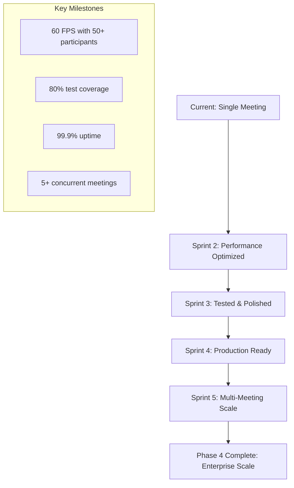

# theboardroom Phase 4 Sprint Planning
**Date:** 2026-01-09  
**Project Status:** Phase 1 Foundation (40% Complete)  
**Target:** Production-ready visualization system for 50+ participants  
**Architecture:** Event-driven component pattern with dual 2D/3D rendering  

---

## Executive Summary

This sprint plan outlines the roadmap for completing theboardroom Phase 4 implementation, transforming the current foundation into a production-ready visualization system capable of supporting 50+ participants with 60 FPS performance. The plan addresses critical technical debt, establishes comprehensive testing infrastructure, and builds toward enterprise-scale deployment.

**Current State:** Sprint 1 active with 2/5 stories completed (8/21 points, 38% progress)  
**Critical Gaps:** Zero test coverage, performance monitoring absent, CI/CD missing  
**Phase 4 Vision:** Multi-meeting dashboard, enterprise deployment, advanced security compliance  

---

## Sprint 1: Foundation Completion (Current - 2026-01-16)

### Remaining Stories (3 stories, 13 points)

#### TB-003: Participant Entity Management System [5 points]
**As a** meeting facilitator  
**I want** robust participant management with dynamic scaling  
**So that** the system can handle varying meeting sizes efficiently  

**Acceptance Criteria:**
- [ ] Implement adaptive participant layout algorithm for 5-50 participants
- [ ] Add participant pooling system to reuse visual elements
- [ ] Create smooth participant addition/removal animations
- [ ] Implement participant state persistence across rounds
- [ ] Add participant role-based visual differentiation
- [ ] Performance: <50ms latency for participant operations
- [ ] Memory: <10MB overhead per participant

**Implementation Sequence:**
1. Refactor circular arrangement algorithm in `BoardroomScene2D.arrangeParticipants()`
2. Implement participant object pooling in `src/utils/ParticipantPool.ts`
3. Add role-based styling system with color/icon mapping
4. Create smooth transition animations using PixiJS tweens
5. Add performance monitoring hooks

**Dependencies:** PixiJS 8.15.0, existing BoardroomScene2D architecture  
**Test Requirements:** Unit tests for layout algorithm, integration tests for participant lifecycle  

#### TB-004: Speaking Indicators and Animations [4 points]
**As a** meeting observer  
**I want** clear visual feedback when participants speak  
**So that** I can follow conversation flow and turn management  

**Acceptance Criteria:**
- [ ] Implement smooth glow effects for speaking participants
- [ ] Add turn-type visual differentiation (response vs turn)
- [ ] Create particle effects for active speakers
- [ ] Implement speaking animation duration tracking
- [ ] Add audio-visual synchronization hooks
- [ ] Performance: Maintain 60 FPS with 10+ simultaneous animations
- [ ] Visual: Clear distinction between response (blue) and turn (green) states

**Implementation Sequence:**
1. Enhance `Participant2D` interface with animation state management
2. Implement PixiJS particle system for speaking effects
3. Create color-coded glow system (cyan for turns, purple for responses)
4. Add animation timing and easing functions
5. Integrate with HUDController for state synchronization

**Dependencies:** PixiJS particle container, existing animation loop  
**Test Requirements:** Visual regression tests, performance benchmarking  

#### TB-005: Meeting State Visualization [4 points]
**As a** technical lead  
**I want** comprehensive meeting state representation  
**So that** I can monitor meeting progress and identify issues  

**Acceptance Criteria:**
- [ ] Implement meeting lifecycle state machine
- [ ] Add consensus building visualization
- [ ] Create round progression indicators
- [ ] Implement meeting timeout handling
- [ ] Add state transition animations
- [ ] Integration: Full event type coverage (9 event types)
- [ ] Reliability: Handle malformed events gracefully

**Implementation Sequence:**
1. Extend `MeetingState` interface with comprehensive status tracking
2. Implement state machine in `BoardroomScene2D.updateMeetingState()`
3. Add consensus meter integration with participant agreement tracking
4. Create round completion animations and summary displays
5. Implement error recovery for invalid event payloads

**Dependencies:** All event types from BloodbankEventSource  
**Test Requirements:** State machine unit tests, event handling integration tests  

### Sprint 1 Testing Strategy

**Critical Priority:** Establish testing infrastructure before advancing to Sprint 2

**Testing Infrastructure Setup:**
```bash
# Install testing dependencies
bun add -D vitest @vitest/coverage-v8 @vitest/ui playwright @playwright/test

# Create test structure
mkdir -p tests/unit/{events,scenes,ui,utils}
mkdir -p tests/integration
mkdir -p tests/e2e
```

**Test Coverage Targets:**
- Unit tests: 80% coverage minimum
- Integration tests: 60% coverage minimum  
- E2E tests: Critical user journeys
- Performance tests: 60 FPS benchmarks

---

## Sprint 2: Core Visualization Enhancement (2026-01-17 to 2026-01-30)

### Performance Optimization Stories

#### TB-006: 60 FPS Performance Optimization [8 points]
**As a** system administrator  
**I want** consistent 60 FPS performance  
**So that** visualization remains smooth during large meetings  

**Acceptance Criteria:**
- [ ] Implement adaptive detail levels for 5-50 participants
- [ ] Add sprite batching optimization for participant rendering
- [ ] Create viewport culling for off-screen elements
- [ ] Implement texture atlas system for portraits
- [ ] Add frame timing monitoring and throttling
- [ ] Performance: 60 FPS with 50 participants on M2 MacBook
- [ ] Memory: <500MB peak usage with maximum participants

**Implementation Sequence:**
1. Create `src/utils/PerformanceManager.ts` with FPS monitoring
2. Implement adaptive quality system based on participant count
3. Optimize PixiJS sprite batching in participant container
4. Create texture atlas generator for portrait images
5. Add viewport culling for performance-critical scenarios

**Technical Implementation:**
```typescript
// PerformanceManager.ts
class PerformanceManager {
  private fpsHistory: number[] = [];
  private adaptiveQuality: AdaptiveQuality;
  
  monitorFrameTime(delta: number): void {
    this.fpsHistory.push(1000 / delta);
    if (this.fpsHistory.length > 60) this.fpsHistory.shift();
    
    const avgFps = this.fpsHistory.reduce((a, b) => a + b, 0) / this.fpsHistory.length;
    if (avgFps < 55) this.adaptiveQuality.reduceQuality();
    else if (avgFps > 62) this.adaptiveQuality.increaseQuality();
  }
}
```

#### TB-007: Memory Management and Cleanup [5 points]
**As a** DevOps engineer  
**I want** efficient memory management  
**So that** long-running meetings don't cause memory leaks  

**Acceptance Criteria:**
- [ ] Implement object pooling for reusable elements
- [ ] Add texture cleanup and garbage collection
- [ ] Create memory usage monitoring
- [ ] Implement meeting cleanup procedures
- [ ] Add memory leak detection
- [ ] Memory: <10MB growth per hour of meeting time
- [ ] Cleanup: Complete memory release on meeting completion

#### TB-008: Event Latency Optimization [5 points]
**As a** meeting facilitator  
**I want** <200ms event-to-visual latency  
**So that** visual feedback feels instantaneous  

**Acceptance Criteria:**
- [ ] Optimize event processing pipeline
- [ ] Implement event batching for high-frequency updates
- [ ] Add client-side event queuing
- [ ] Create debounced update mechanisms
- [ ] Implement WebSocket connection optimization
- [ ] Latency: <200ms from Bloodbank event to visual update
- [ ] Throughput: Handle 100+ events per second

### Visual Enhancement Stories

#### TB-009: Advanced Particle Effects [3 points]
**As a** product manager  
**I want** enhanced visual effects  
**So that** the visualization is more engaging for stakeholders  

**Acceptance Criteria:**
- [ ] Implement particle systems for speaking effects
- [ ] Add consensus celebration animations
- [ ] Create meeting completion effects
- [ ] Add cyberpunk glitch effects
- [ ] Implement customizable effect intensity
- [ ] Performance: Effects don't impact 60 FPS target

#### TB-010: Responsive Design Implementation [3 points]
**As a** user  
**I want** responsive visualization  
**So that** I can view meetings on different screen sizes  

**Acceptance Criteria:**
- [ ] Implement mobile viewport support
- [ ] Add tablet optimization
- [ ] Create adaptive HUD layouts
- [ ] Implement touch interaction support
- [ ] Add portrait/landscape orientation handling
- [ ] Support: 320px to 4K resolution ranges

---

## Sprint 3: Testing and Polish (2026-01-31 to 2026-02-13)

### Testing Infrastructure Stories

#### TB-011: Comprehensive Unit Test Suite [6 points]
**As a** developer  
**I want** thorough unit test coverage  
**So that** code changes don't break existing functionality  

**Acceptance Criteria:**
- [ ] Achieve 80% unit test coverage
- [ ] Test all event processing handlers
- [ ] Unit test participant layout algorithms
- [ ] Test state management systems
- [ ] Test utility functions and helpers
- [ ] Integration: Vitest with Vite build system
- [ ] CI: Automated test execution on commits

**Test Structure:**
```
tests/
├── unit/
│   ├── events/
│   │   ├── BloodbankEventSource.test.ts
│   │   ├── EventSourceFactory.test.ts
│   │   └── MockEventSource2D.test.ts
│   ├── scenes/
│   │   ├── BoardroomScene2D.test.ts
│   │   └── Participant2D.test.ts
│   ├── ui/
│   │   └── HUDController.test.ts
│   └── utils/
│       ├── PerformanceManager.test.ts
│       └── ParticipantPool.test.ts
```

#### TB-012: Integration Test Implementation [4 points]
**As a** QA engineer  
**I want** integration test coverage  
**So that** component interactions work correctly  

**Acceptance Criteria:**
- [ ] Test event → scene → HUD integration pipeline
- [ ] Test WebSocket connection lifecycle
- [ ] Test participant management workflows
- [ ] Test meeting state transitions
- [ ] Test error handling and recovery
- [ ] Coverage: 60% of integration scenarios
- [ ] Automation: Run on every PR

#### TB-013: End-to-End Test Suite [4 points]
**As a** product owner  
**I want** E2E test coverage  
**So that** complete user workflows function correctly  

**Acceptance Criteria:**
- [ ] Test complete meeting lifecycle
- [ ] Test multi-participant scenarios
- [ ] Test WebSocket vs Mock mode switching
- [ ] Test performance benchmarks
- [ ] Test cross-browser compatibility
- [ ] Framework: Playwright for browser automation
- [ ] Visual: Screenshot comparison testing

### Performance Validation Stories

#### TB-014: Performance Benchmarking [3 points]
**As a** performance engineer  
**I want** automated performance tests  
**So that** performance regressions are caught early  

**Acceptance Criteria:**
- [ ] Implement 60 FPS benchmark tests
- [ ] Create memory usage benchmarks
- [ ] Add event latency measurements
- [ ] Implement load testing scenarios
- [ ] Create performance regression detection
- [ ] Baseline: M2 MacBook performance metrics
- [ ] Alert: Automatic alerts for >10% regression

#### TB-015: Cross-Browser Compatibility [3 points]
**As a** frontend developer  
**I want** cross-browser testing  
**So that** visualization works consistently  

**Acceptance Criteria:**
- [ ] Test Chrome, Firefox, Safari compatibility
- [ ] Verify WebGL support across browsers
- [ ] Test mobile browser compatibility
- [ ] Validate CSS cyberpunk styling
- [ ] Test touch interaction support
- [ ] Coverage: Latest 2 versions of each browser
- [ ] Automation: BrowserStack integration

---

## Sprint 4: Deployment and Monitoring (2026-02-14 to 2026-02-27)

### Deployment Infrastructure Stories

#### TB-016: CI/CD Pipeline Implementation [6 points]
**As a** DevOps engineer  
**I want** automated deployment pipeline  
**So that** releases are consistent and reliable  

**Acceptance Criteria:**
- [ ] Implement GitHub Actions workflow
- [ ] Add automated testing on PR
- [ ] Create staging deployment process
- [ ] Implement production deployment
- [ ] Add rollback capabilities
- [ ] Integration: GitHub → Vercel/Netlify
- [ ] Security: Environment variable management

**GitHub Actions Workflow:**
```yaml
name: theboardroom CI/CD
on:
  push:
    branches: [main, develop]
  pull_request:

jobs:
  test:
    runs-on: ubuntu-latest
    steps:
      - uses: actions/checkout@v4
      - uses: oven-sh/setup-bun@v1
      - run: bun install
      - run: bun run typecheck
      - run: bun run test:unit --coverage
      - run: bun run test:e2e
      
  deploy-staging:
    needs: test
    if: github.ref == 'develop'
    runs-on: ubuntu-latest
    steps:
      - run: bun run build
      - run: bun run deploy:staging
      
  deploy-production:
    needs: test
    if: github.ref == 'main'
    runs-on: ubuntu-latest
    steps:
      - run: bun run build
      - run: bun run deploy:production
```

#### TB-017: Environment Configuration Management [3 points]
**As a** system administrator  
**I want** environment-specific configuration  
**So that** deployments are environment-aware  

**Acceptance Criteria:**
- [ ] Create development environment config
- [ ] Implement staging environment setup
- [ ] Add production environment configuration
- [ ] Implement feature flags system
- [ ] Add environment variable validation
- [ ] Security: Secure credential management
- [ ] Documentation: Environment setup guide

#### TB-018: Production Deployment Setup [4 points]
**As a** operations team member  
**I want** production deployment  
**So that** users can access the visualization  

**Acceptance Criteria:**
- [ ] Configure CDN for static asset delivery
- [ ] Implement domain and SSL setup
- [ ] Add monitoring and alerting
- [ ] Create backup and recovery procedures
- [ ] Implement scaling strategies
- [ ] Performance: Global CDN distribution
- [ ] Reliability: 99.9% uptime target

### Monitoring and Observability Stories

#### TB-019: Application Monitoring [4 points]
**As a** operations engineer  
**I want** comprehensive monitoring  
**So that** system health is visible  

**Acceptance Criteria:**
- [ ] Implement client-side error tracking
- [ ] Add performance metrics collection
- [ ] Create user analytics tracking
- [ ] Implement custom event monitoring
- [ ] Add real-time dashboard
- [ ] Integration: Sentry for error tracking
- [ ] Metrics: FPS, memory, event latency

#### TB-020: Health Checks and Alerting [3 points]
**As a** site reliability engineer  
**I want** health monitoring and alerts  
**So that** issues are detected proactively  

**Acceptance Criteria:**
- [ ] Implement health check endpoints
- [ ] Add performance degradation alerts
- [ ] Create meeting failure notifications
- [ ] Implement connection status monitoring
- [ ] Add automated incident response
- [ ] Alert: WebSocket connection failures
- [ ] Escalation: PagerDuty integration

---

## Sprint 5: Phase 4 Features (2026-02-28 to 2026-03-13)

### Multi-Meeting Support Stories

#### TB-021: Multi-Meeting Dashboard [8 points]
**As an** executive user  
**I want** multiple meeting visualization  
**So that** I can monitor concurrent meetings  

**Acceptance Criteria:**
- [ ] Implement multi-meeting view layout
- [ ] Add meeting grid/tile interface
- [ ] Create meeting selection and switching
- [ ] Implement shared event source management
- [ ] Add meeting comparison views
- [ ] Performance: Support 5+ concurrent meetings
- [ ] UX: Intuitive meeting navigation

**Technical Architecture:**
```typescript
// MultiMeetingManager.ts
class MultiMeetingManager {
  private meetings: Map<string, MeetingInstance> = new Map();
  private sharedEventSource: SharedEventSource;
  
  async addMeeting(meetingId: string): Promise<void> {
    const instance = new MeetingInstance(meetingId);
    this.meetings.set(meetingId, instance);
    
    // Optimize shared resources
    instance.setSharedTextureCache(this.sharedTextureCache);
    instance.setSharedEventProcessor(this.sharedEventProcessor);
  }
}
```

#### TB-022: Meeting Recording and Playback [6 points]
**As a** meeting facilitator  
**I want** meeting recording capabilities  
**So that** I can review and share meeting visualizations  

**Acceptance Criteria:**
- [ ] Implement meeting event recording
- [ ] Add playback controls and timeline
- [ ] Create export functionality
- [ ] Implement sharing capabilities
- [ ] Add playback speed controls
- [ ] Format: JSON event stream export
- [ ] Quality: 1080p recording capability

### Enterprise Features Stories

#### TB-023: Enterprise Security Implementation [5 points]
**As a** security officer  
**I want** enterprise-grade security  
**So that** sensitive meeting data is protected  

**Acceptance Criteria:**
- [ ] Implement OAuth2/OIDC authentication
- [ ] Add role-based access control
- [ ] Create audit logging system
- [ ] Implement data encryption
- [ ] Add compliance reporting
- [ ] Standard: SOC 2 compliance
- [ ] Encryption: AES-256 for data at rest

#### TB-024: Advanced Analytics and Insights [4 points]
**As a** data analyst  
**I want** meeting analytics  
**So that** I can understand collaboration patterns  

**Acceptance Criteria:**
- [ ] Implement participation analytics
- [ ] Add consensus building metrics
- [ ] Create collaboration pattern detection
- [ ] Implement sentiment analysis
- [ ] Add meeting effectiveness scoring
- [ ] Export: CSV/JSON data export
- [ ] Insights: Automated pattern recognition

#### TB-025: API and Integration Framework [4 points]
**As a** system integrator  
**I want** comprehensive APIs  
**So that** I can integrate with external systems  

**Acceptance Criteria:**
- [ ] Create REST API for meeting data
- [ ] Add WebSocket API for real-time data
- [ ] Implement webhook support
- [ ] Create plugin architecture
- [ ] Add third-party integrations
- [ ] Documentation: OpenAPI 3.0 spec
- [ ] SDK: JavaScript/TypeScript client

---

## Technical Implementation Sequence

### Phase 4 Architecture Evolution



### Critical Path Dependencies

1. **Testing Infrastructure** → All subsequent sprints depend on robust testing
2. **Performance Optimization** → Multi-meeting support requires efficient resource usage  
3. **CI/CD Pipeline** → Production deployment requires automated reliability
4. **WebSocket Scaling** → Multi-meeting requires connection management optimization

---

## Risk Assessment and Mitigation

### High-Risk Items

#### Risk 1: Performance Degradation at Scale
**Impact:** Critical | **Probability:** High  
**Mitigation:** 
- Implement performance monitoring from Sprint 1
- Create adaptive quality system
- Establish performance benchmarks
- Plan horizontal scaling strategy

#### Risk 2: Testing Infrastructure Delay
**Impact:** High | **Probability:** Medium  
**Mitigation:**
- Prioritize testing setup in Sprint 1
- Create parallel testing tracks
- Implement incremental test coverage
- Use test-driven development practices

#### Risk 3: WebSocket Connection Scaling
**Impact:** High | **Probability:** Medium  
**Mitigation:**
- Implement connection pooling early
- Design shared event processing
- Create connection health monitoring
- Plan fallback strategies

### Technical Debt Management

**Current Debt:**
- Zero test coverage (Critical)
- Mock source code duplication
- Missing performance monitoring
- Absent CI/CD pipeline

**Debt Retirement Plan:**
- Sprint 1: Testing infrastructure (highest priority)
- Sprint 2: Mock source consolidation
- Sprint 3: Performance monitoring implementation
- Sprint 4: CI/CD pipeline establishment

---

## Success Metrics and Validation

### Sprint Completion Criteria

**Sprint 1 Success:**
- 5/5 stories completed (100%)
- 80% unit test coverage achieved
- All acceptance criteria met
- Performance benchmarks established

**Sprint 2 Success:**
- 60 FPS with 50 participants verified
- Memory usage <500MB confirmed
- Event latency <200ms measured
- Cross-browser compatibility validated

**Sprint 3 Success:**
- 80% overall test coverage achieved
- E2E tests passing on all browsers
- Performance regression detection active
- Visual regression testing implemented

**Sprint 4 Success:**
- 99.9% uptime achieved in production
- Automated deployment pipeline active
- Monitoring and alerting operational
- Health checks passing consistently

**Sprint 5 Success:**
- 5+ concurrent meetings supported
- Multi-meeting dashboard functional
- Enterprise security compliance met
- API framework operational

### Key Performance Indicators

**Technical KPIs:**
- Frame Rate: 60 FPS (target), 55 FPS (minimum)
- Memory Usage: <500MB (target), <750MB (maximum)
- Event Latency: <200ms (target), <500ms (maximum)
- Test Coverage: 80% (target), 70% (minimum)
- Uptime: 99.9% (target), 99.5% (minimum)

**Business KPIs:**
- Sprint Completion Rate: 100% (target), 90% (minimum)
- Defect Escape Rate: <5% (target), <10% (maximum)
- Deployment Frequency: Daily (target), Weekly (minimum)
- Lead Time: <1 day (target), <3 days (maximum)

---

## Resource Allocation and Team Structure

### Development Team Requirements

**Core Team (4 developers):**
- **Frontend Lead**: PixiJS/WebGL optimization, 2D rendering expertise
- **Full-Stack Developer**: TypeScript, WebSocket, event processing
- **QA Engineer**: Test automation, performance benchmarking
- **DevOps Engineer**: CI/CD, deployment, monitoring infrastructure

**Part-time Support:**
- **UX Designer**: Responsive design, mobile optimization
- **Security Engineer**: Enterprise security implementation
- **Product Manager**: Feature prioritization, stakeholder communication

### Infrastructure Requirements

**Development Environment:**
- GitHub repository with branch protection
- Vercel/Netlify for preview deployments
- BrowserStack for cross-browser testing
- Sentry for error tracking and monitoring

**Production Infrastructure:**
- CDN for global asset distribution
- SSL certificates and domain management
- Monitoring dashboard (Grafana/DataDog)
- Alerting system (PagerDuty integration)

---

## Conclusion and Next Steps

This sprint plan provides a comprehensive roadmap for transforming theboardroom from its current foundation phase into a production-ready, enterprise-scale visualization system. The plan addresses critical technical debt while building toward Phase 4 objectives of multi-meeting support, enterprise deployment, and advanced analytics.

**Immediate Actions:**
1. **Complete Sprint 1 testing infrastructure** - Critical path dependency
2. **Establish performance benchmarks** - Required for optimization validation  
3. **Implement CI/CD pipeline** - Essential for reliable deployment
4. **Begin multi-meeting architecture design** - Complex scaling challenge

**Success Factors:**
- Testing infrastructure must be prioritized over feature development
- Performance optimization requires continuous monitoring
- Enterprise features depend on solid security foundation
- Multi-meeting scaling needs architectural foresight

**Risk Mitigation:**
- Parallel development tracks for independent components
- Incremental delivery with continuous validation
- Performance testing throughout development cycle
- Stakeholder feedback loops at sprint boundaries

The plan balances technical excellence with business requirements, ensuring theboardroom emerges as a robust, scalable platform ready for enterprise deployment and multi-meeting visualization at scale.